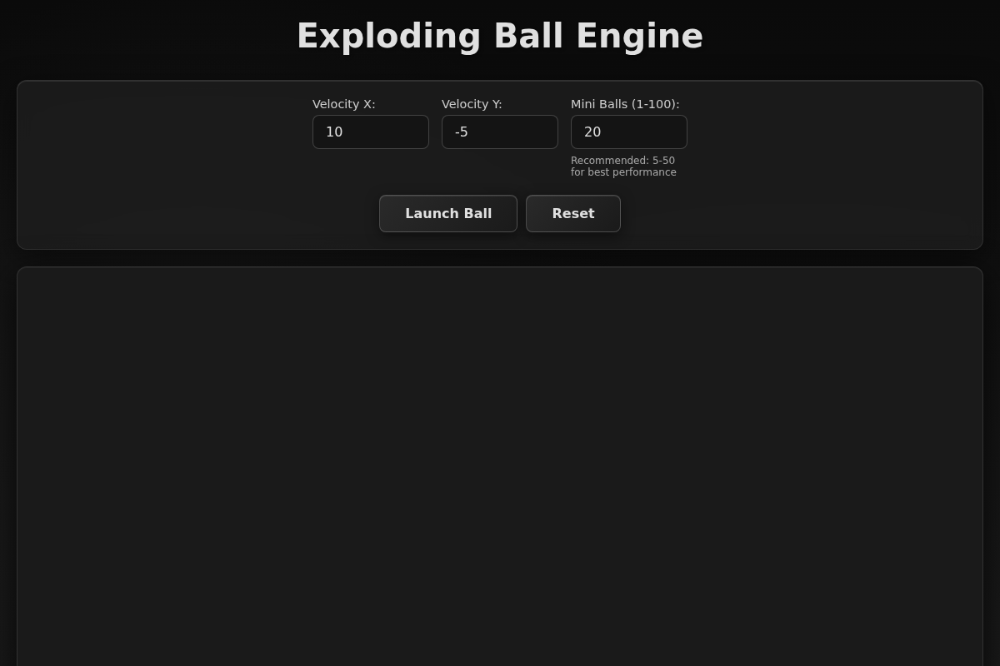

# Exploding Ball Engine

A web-based physics simulation featuring an exploding ball engine with realistic physics, collision detection, and beautiful visuals.



## Features

- **Physics Engine**: Powered by Matter.js for accurate physics simulation
- **Exploding Balls**: Launch a ball that explodes into multiple mini balls
- **Customizable Velocity**: Set X and Y velocity values
- **Collision Detection**: Realistic collisions between balls and walls
- **Clean UI**: Modern, gradient-based design with glassmorphism effects
- **Interactive Controls**: Adjust explosion force and number of mini balls

## How to Run

1. Start the web server:
   ```bash
   python3 server.py
   ```

2. The application will automatically open in your browser at `http://localhost:8000`

3. Enter velocity values and click "Launch Ball" to see the explosion!

## Controls

- **Velocity X**: Horizontal velocity of the ball
- **Velocity Y**: Vertical velocity of the ball
- **Mini Balls**: Number of mini balls created on explosion (1 - 100, recommended: 5-50)
- **Launch Ball**: Fire a new ball with the specified velocity
- **Reset**: Clear all balls and reset the simulation

**Note**: The explosion force is automatically calculated based on the ball's impact velocity for realistic physics.

## Technical Details

- Uses Matter.js physics engine for accurate physics simulation
- Canvas-based rendering for smooth animations
- Responsive design that adapts to window size
- Real-time collision detection and response
